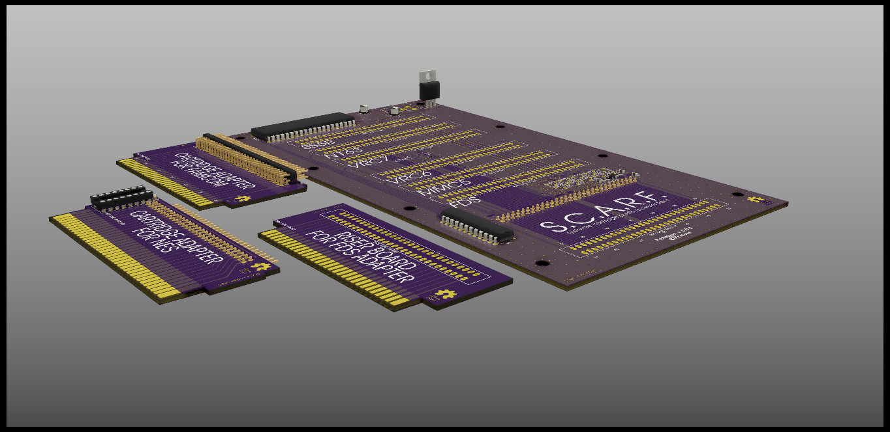

# S.C.A.R.F. Expansion Audio Interfacer

An Open-Source HardWare (OSHW) Famicom expansion audio interfacer.

Currently a work in progress, but the first prototype is functionally complete (I hope!)

## License

- The PCB and schematics are licensed under the TAPR Open Hardware License ([www.tapr.org/OHL](http://www.tapr.org/OHL)).
- The PLD source code files are licensed under GPL 2.0 or higher. (https://www.gnu.org/licenses/old-licenses/gpl-2.0.html)
- © Persune 2021

## Credits

- lidnariq, grievre, Iyatemu, and plgDavid; thank you for being patient with me and my inquiry!
- Iyatemu - providing custom footprints and schematic symbols
- lidnariq - providing advice for my schematics and addressing logic
- grievre - providing advice for my PCB design
- Special thanks to the NESDEV community, this project wouldn't have been possible without their extensive help!

## Support

Support me on [Ko-Fi](https://ko-fi.com/persune) to help me afford hardware development equipment and further improve this project!

